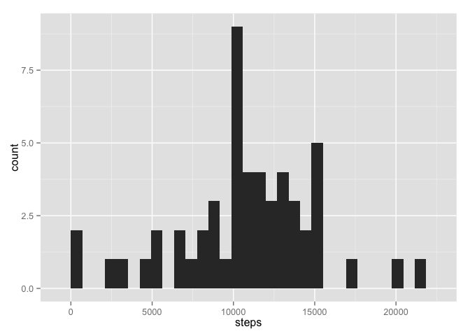
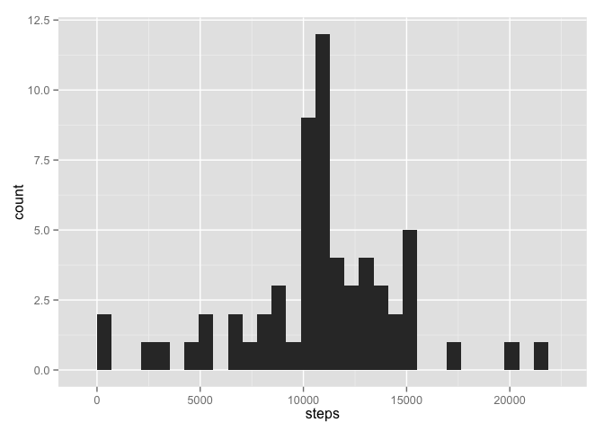
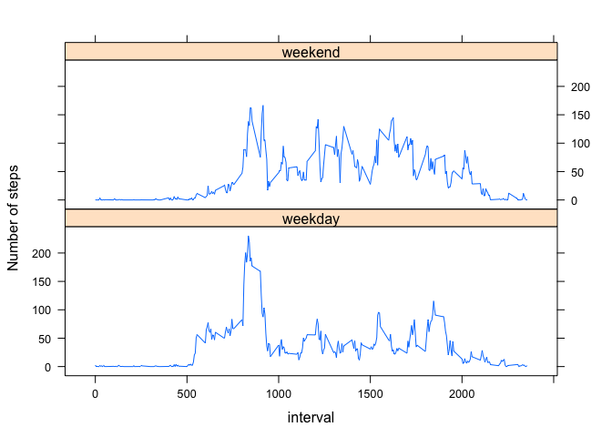

## Reproducible Research: Peer Assessment 1


## Loading and preprocessing the data
First, load the raw data and omit missing values.

```r
mydata <- read.csv("~/RepData_PeerAssessment1/activity.csv")
mydata$date <- as.Date(mydata$date)
newdata <- na.omit(mydata)
```

## What is mean total number of steps taken per day?

Next, make a histogram of total number of all steps taken each day. That means y-axis represents the number of steps taken every day, and x-axis represents the counts of each number appears. We'll also calculate the mean and median of the total numbers (one mean and median for all numbers).


```r
totalSteps <- aggregate(steps ~ date, newdata, sum)
library(ggplot2)
ggplot(totalSteps, aes(x=steps)) + geom_histogram()
```

```
## stat_bin: binwidth defaulted to range/30. Use 'binwidth = x' to adjust this.
```

 

```r
mean(totalSteps$steps)
```

```
## [1] 10766
```

```r
median(totalSteps$steps)
```

```
## [1] 10765
```

## What is the average daily activity pattern?

Next, make a plot (type="l") of the 5-minute interval(x-axis) and the mean of step taken each interval across all days (y-axis). Also, find the interval with the maximum number of steps.


```r
meanSteps <- aggregate(newdata$steps, list(interval=newdata$interval), mean)
with(meanSteps, plot(interval, x, type="l", xlab="5 Minute Interval", ylab="Mean Steps"))
```

 

```r
meanSteps[which.max(meanSteps$x), ]
```

```
##     interval     x
## 104      835 206.2
```

## Imputing missing values

Next, we'll report the total number of missing values in the raw data and replace NAs with mean of interval. The strategy here is first to add a new column of 5 minute interval mean to the raw dataset by merge() function. Then find the NAs in steps and replace them with the interval mean we just added. Then, make a histogram of the new dataset and report the mean and median just as what we did previously. 


```r
nrow(mydata[!complete.cases(mydata), ])
```

```
## [1] 2304
```

```r
mergeMean <- merge(mydata, meanSteps, by="interval")
mergeMean$steps[is.na(mergeMean$steps)] <- mergeMean$x[is.na(mergeMean$steps)]
totalStepsna <- aggregate(steps ~ date, mergeMean, sum)
ggplot(totalStepsna, aes(x=steps)) + geom_histogram()
```

```
## stat_bin: binwidth defaulted to range/30. Use 'binwidth = x' to adjust this.
```

 

```r
mean(totalStepsna$steps)
```

```
## [1] 10766
```

```r
median(totalStepsna$steps)
```

```
## [1] 10766
```

## Are there differences in activity patterns between weekdays and weekends?

Finally, we'll add a new column with two levels - "weekday" and "weekend", and make a plot comparing the average steps taken each interval across weekday days and weekend days.


```r
mergeMean$day <- weekdays(mergeMean$date)
mergeMean$day <- factor(mergeMean$day)
library(plyr)
mergeMean$day <- revalue(mergeMean$day, c("Monday"="weekday", "Tuesday"="weekday", 
                                          "Wednesday"="weekday", "Thursday"="weekday", 
                                          "Friday"="weekday", "Saturday"="weekend", "Sunday"="weekend"))
day.mean <- aggregate(mergeMean$steps, list(interval=mergeMean$interval, day=mergeMean$day), mean)
library(lattice)
xyplot(x ~ interval|day, data=day.mean, type="l", layout=c(1, 2), ylab="Number of steps")
```

 


